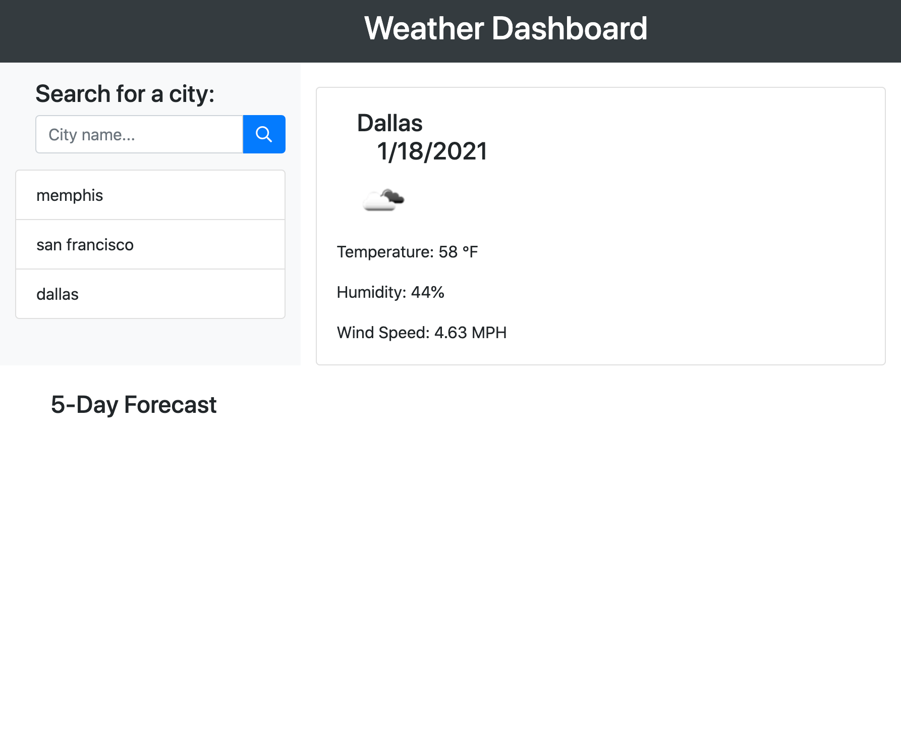

# Weather Dashboard

This application is meant to display weather information from a user-provided city, including temperature, 
humidity, and wind speed. There must also be a 5-day forecast presented at the bottom of the application.

The initial framework is written in HTML, with minimal custom CSS styling, and Javascript/Jquery logic handling DOM manipulation and interactivity.

# Screenshot

# Application URL:
https://kirkbalop.github.io/weather-dashboard/.
